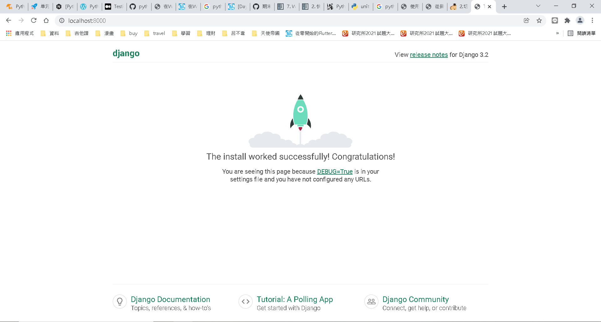
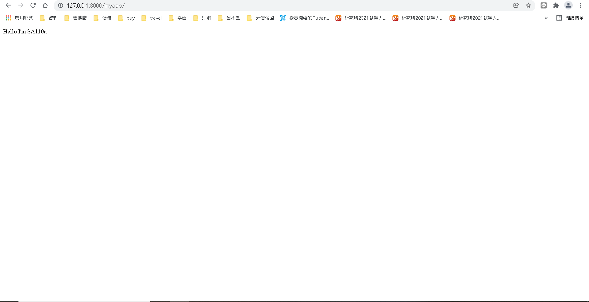
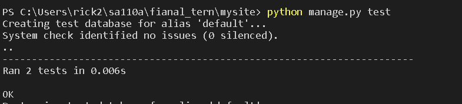

# 期末作業
### 程式碼及內容參考網路上之資料，出處及來源皆紀載於參考資料
## begining(v1.0)
* 建立Django專案並透過selenium呼叫chrome去執行Django server 再利用assert去判斷是否可成功如果可以show pass 然後關閉瀏覽器
* [begintest.py](mysite/mysite/begin_test.py)備註:此單元測只有當Django剛初始化尚未新增app時可成功執行

## helloworld (v1.1)
* 建立一個newapp，利用Django內建的單元測試功能，測試程式碼是否正確以及連線是否可以
* [tests](mysite/myapp/tests.py)

## 參考資料
* [Testing in Python(feat. Django)（一、單元測試及功能測試篇）](https://medium.com/into-the-night/testing-in-python-feat-django-%E4%B8%80-%E5%96%AE%E5%85%83%E6%B8%AC%E8%A9%A6%E5%8F%8A%E5%8A%9F%E8%83%BD%E6%B8%AC%E8%A9%A6%E7%AF%87-94d68ef465e3)
* [Python 3 Tutorial 第十一堂（2）使用 unittest 單元測試](https://openhome.cc/Gossip/CodeData/PythonTutorial/UnitTestPy3.html)