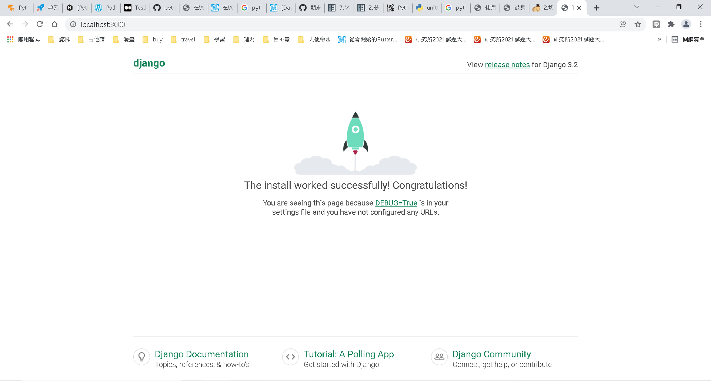
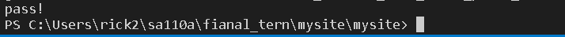
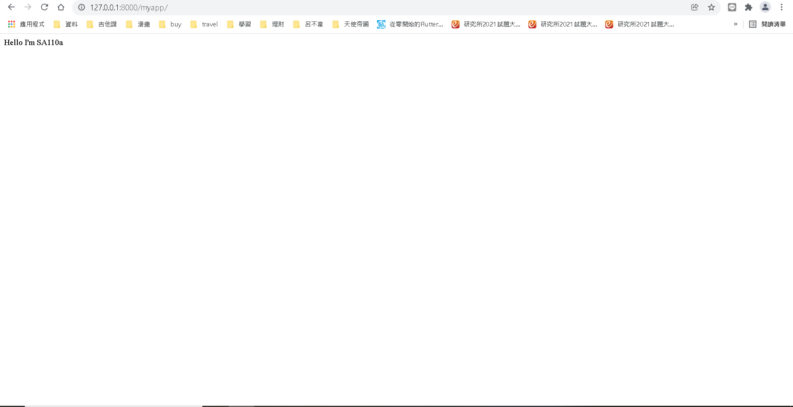
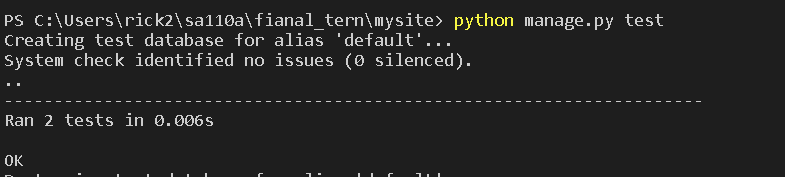
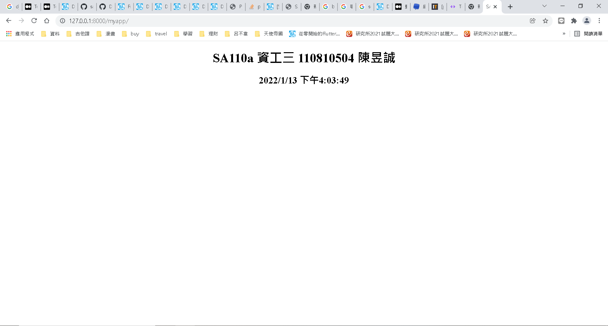
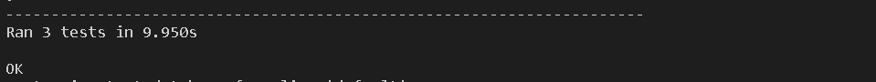
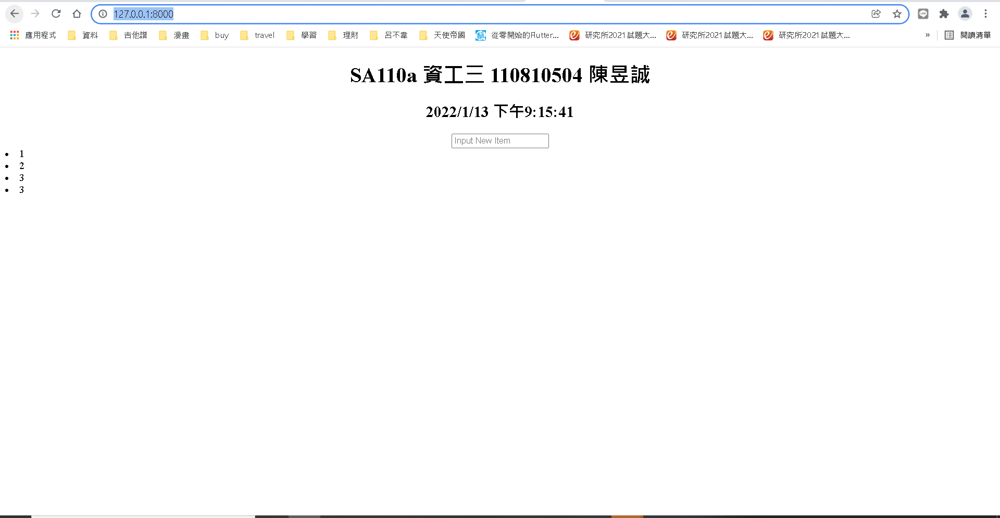
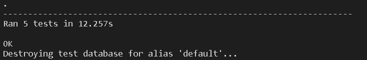

# 簡易陽春留言板
## 說明
* 程式碼及內容參考網路上之資料，出處及來源皆紀載於參考資料
* 透過利用Django的單元測試功能以及selenium的自動化測試去進行各功能的測試
* 環境版本:
  * Python    3.9.9
  * Django    3.2.5
  * selenium  3.141.0
  * VScode    1.63.2
## 各主要版本之連結
* [v1.0](https://github.com/cycyucheng1010/sa110a/tree/v1.0) 
* [v1.1](https://github.com/cycyucheng1010/sa110a/tree/v1.1)
* [v1.2](https://github.com/cycyucheng1010/sa110a/tree/v1.2)
* [v1.4](https://github.com/cycyucheng1010/sa110a/tree/v1.4)
## begining(v1.0)
1. 設置環境
2. 建立Django專案並透過selenium呼叫chrome去執行Django server 再利用assert去判斷是否可成功如果可以show pass 然後關閉瀏覽器
3. [begintest.py](https://github.com/cycyucheng1010/sa110a/blob/v1.0/fianal_tern/mysite/mysite/begin_test.py)備註:此單元測只有當Django剛初始化尚未新增app時可成功執行

## helloworld (v1.1)
1. 建立一個newapp，利用Django內建的單元測試功能:
     1. 測試程式碼是否正確
     2.  連線是否可以

2. [tests](https://github.com/cycyucheng1010/sa110a/blob/v1.1/fianal_tern/mysite/myapp/tests.py)

## myapp(v1.2)
1. 新增會顯示即時時間的html然後利用selenium及Django test進行測試
2. [testmyapp](https://github.com/cycyucheng1010/sa110a/blob/v1.2/fianal_tern/mysite/mysite/testmyapp.py)

## 完成大部分測試(v1.4)
1. 由於v1.3在修改時發生大規模錯誤導致捨棄原本的branch v1.3 ，版本直接跳躍到v1.4
2. 此版本完成以下事項:
     1. 將myapp的路徑從副頁拉到主頁(原:http://127.0.0.1:8000/myapp/ ， 現:http://127.0.0.1:8000/)
     2. 新增html中的input功能
     3. 完成測試並成功
3. 這個版本的測試有以下內容:
     1. 利用django test去進行assert判斷
     2. 利用selenium去進行模擬使用者使用並進行判斷:
          * html h1的內容是否正確
          * 是否可以成功input 內容到id = new item裡面
          * 是否可成功呈現輸入後儲存之內容
4. [tests.py ](https://github.com/cycyucheng1010/sa110a/blob/v1.4/fianal_tern/mysite/myapp/tests.py) [testmyapp.py](https://github.com/cycyucheng1010/sa110a/blob/v1.4/fianal_tern/mysite/mysite/testmyapp.py)

## 參考資料
* [Testing in Python(feat. Django)（一、單元測試及功能測試篇）](https://medium.com/into-the-night/testing-in-python-feat-django-%E4%B8%80-%E5%96%AE%E5%85%83%E6%B8%AC%E8%A9%A6%E5%8F%8A%E5%8A%9F%E8%83%BD%E6%B8%AC%E8%A9%A6%E7%AF%87-94d68ef465e3)
* [Python 3 Tutorial 第十一堂（2）使用 unittest 單元測試](https://openhome.cc/Gossip/CodeData/PythonTutorial/UnitTestPy3.html)
