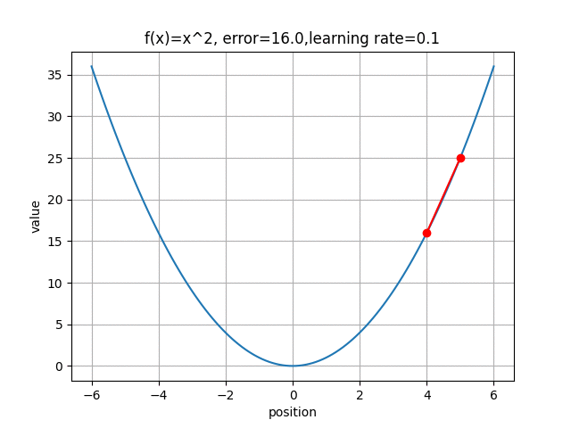
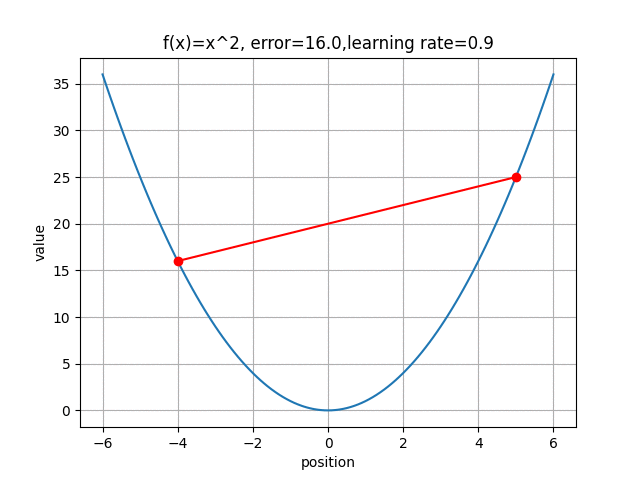

# 梯度下降法 (Gradient Descendent)
### 說明: 內容參考網路上資源，來源網址皆有寫在參考資料中，程式碼100%原創

## 為什麼選擇介紹梯度下降法 

* 人工智慧是近幾年很夯的議題，其中人工智慧中的Deep Learning所使用的原理就是以《梯度下降》(Gradient Descendent) 和《反傳遞算法》(Back Propagation) 為主，而我們專題主要做的部分就是深度學習，故此次的期中報告選擇梯度下降法，讓自己更了解深度學習其背後的數學原理與關係。

## 梯度下降法是什麼
* 微積分找極值方式: 一般微積分說將要找極大值或極小值的式子做微分等於0找解，找到的不是極大值，就是極小值，是極大還是極小就看二階微分帶入找出來的解，看結果是大於0，還是小於0。
    * 例:
        * 原式----> f(x) = x^2 -10x +1
        * 進行微分---> f'(x) =df(x)/dx =2x-10 ==> x=5, f(x)=-24
        * 二次微分--->f''(x) =df'(x)/dx ===>x=2,f(x) =-15
        * 三次微分--->f'''(x) = df''(x)/dx ====>x=0 ,f(x)=1
        * 所以x =5 時 有極值: -24
    * 但是實際應用上不可能利用這種方式慢慢來，於是產生了梯度下降法
    
* 根據維基百科上的說明: 梯度下降法是一個一階最佳化算法，要使用梯度下降法找到一個函數的局部極小值，必須向函數上當前點對應梯度（或者是近似梯度）的反方向的規定步長距離點進行疊代搜索。
    * 備註1: 一階算法指得是，透過一個輸入值得到一個關係，例如:
        * ∀People(x) => Mortal(x);人都會死
        * people(Socrates);蘇格拉底是人
        * Mortal(Socrates);所以蘇格拉底會死
    * 備註2: 當輸入變數很多時，純粹靠《多次前向計算》的《梯度下降法》速度會過慢，因此我們需要使用《反傳遞算法》更有效率的計算《梯度》。有關於反傳遞算法的例子可以參考[反傳遞演算法 -- 手算案例](https://programmermedia.org/root/%E9%99%B3%E9%8D%BE%E8%AA%A0/%E8%AA%B2%E7%A8%8B/%E4%BA%BA%E5%B7%A5%E6%99%BA%E6%85%A7/07-neural/03-net/%E5%8F%8D%E5%82%B3%E9%81%9E%E6%BC%94%E7%AE%97%E6%B3%95%E6%89%8B%E7%AE%97%E6%A1%88%E4%BE%8B.md)

* 梯度下降法是一種不斷去更新參數(這邊參數用x表示)找「解」的方法，所以一定要先隨機產生一組初始參數的「解」，然後根據這組隨機產生的「解」開始算此「解」的梯度方向大小，然後將這個「解」去減去梯度方向


>往箭頭方向則梯度大，反之則小

## 梯度下降法的程式實作
* 利用numpy 及matplot觀察
* [Gradient Descendnet](/code/gd2.py)
``` python
import numpy as np
import matplotlib.pyplot as plt
import matplotlib.animation
# 學習率
learning_rate = 0.1

# 初始位置
start_position = 5
old_position =0
new_position =0
#x介於-6到6,y=x^2
x = np.arange(-6, 6.1, 0.1)
y = x**2


plt.xlabel('position')
plt.ylabel('value')
plt.title('f(x)=x^2')
plt.grid(True)
for i in range(1, 11):
    if i == 1:
        old_position = start_position
    else:
        old_position = new_position
    
    #f(x) = x^2 微分後: f'(x) =2x
    new_position = old_position - learning_rate * (2*old_position)
    plt.plot(x, y)
    plt.grid(True)
    plt.plot((old_position, new_position), (old_position**2, new_position**2), 'ro-')
    title_name = 'f(x)=x^2, error='+str(abs(new_position**2)) +',learning rate='+str(learning_rate)
    plt.title(title_name)
    #plt.title('f(x)=x^2, error=' + '{:.2f}'.format(abs(new_position**2)) +',learning rate='+'{:2.f}'.format(learning_rate))
    plt.show()
```
下圖一為learning rate =0.1,圖二為learning rate=0.9


>圖一



## 心得與感想
* 藉由這次的期中報告透過實作的方式讓我對Gradient Descendent有更深入的了解跟體會，也藉由這次的這個機會順便複習了老師曾在大三人工智慧課堂上上過的，反傳遞算法以及一階算法。
* 另外在實驗中發現當learning rate太大時學習率愈大，每次移動的距離愈長；學習率愈小則反之。但若給值太大，則梯度下降的過程中常會有不穩定的情況發生；若給值太小，就需要更多的迭代次數才能抵達最小值，這在深度學習的loss function中若step太小則可能導致太久才收斂反之則可能導致模型無法收斂，是需要注意的細節之一。


## 參考資料
* [程式人媒體_人工智慧教材_梯度下降法](https://programmermedia.org/root/%E9%99%B3%E9%8D%BE%E8%AA%A0/%E8%AA%B2%E7%A8%8B/%E4%BA%BA%E5%B7%A5%E6%99%BA%E6%85%A7/07-neural/02-gradient/%E6%A2%AF%E5%BA%A6%E4%B8%8B%E9%99%8D%E6%B3%95.md)
* [wiki_梯度下降法](https://zh.wikipedia.org/wiki/%E6%A2%AF%E5%BA%A6%E4%B8%8B%E9%99%8D%E6%B3%95)
[程式人媒體_人工智慧教材_反傳遞演算法 -- 手算案例](https://programmermedia.org/root/%E9%99%B3%E9%8D%BE%E8%AA%A0/%E8%AA%B2%E7%A8%8B/%E4%BA%BA%E5%B7%A5%E6%99%BA%E6%85%A7/07-neural/03-net/%E5%8F%8D%E5%82%B3%E9%81%9E%E6%BC%94%E7%AE%97%E6%B3%95%E6%89%8B%E7%AE%97%E6%A1%88%E4%BE%8B.md)
* [機器/深度學習-基礎數學(二):梯度下降法(gradient descent)](https://chih-sheng-huang821.medium.com/%E6%A9%9F%E5%99%A8%E5%AD%B8%E7%BF%92-%E5%9F%BA%E7%A4%8E%E6%95%B8%E5%AD%B8-%E4%BA%8C-%E6%A2%AF%E5%BA%A6%E4%B8%8B%E9%99%8D%E6%B3%95-gradient-descent-406e1fd001f)
* [[深度學習講中文] 簡單解釋梯度下降法 (Gradient Descent)](https://medium.com/@arlen.mg.lu/%E6%B7%B1%E5%BA%A6%E5%AD%B8%E7%BF%92%E8%AC%9B%E4%B8%AD%E6%96%87-gradient-descent-b2a658815c72)
